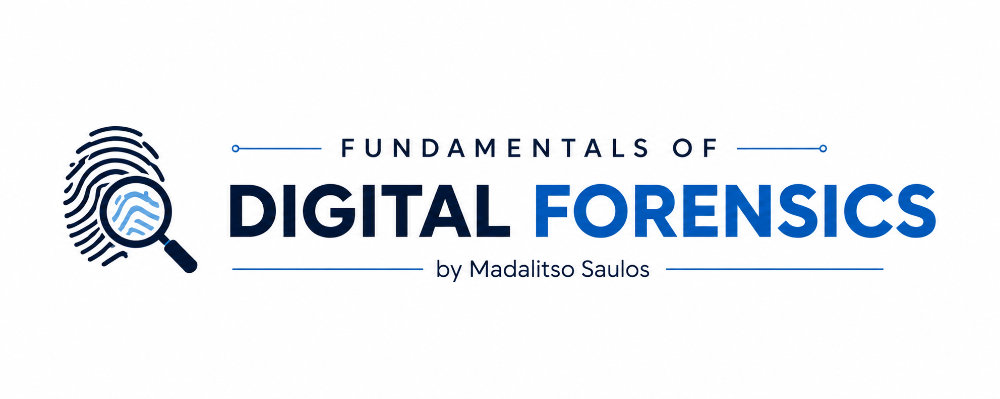

  

> **Fundamentals of Digital Forensics** is an open educational resource designed to teach students, cybersecurity enthusiasts, and IT professionals the fundamental principles of digital forensic investigations. The course follows internationally accepted forensic methodologies and includes practical exercises using industry-standard forensic tools. Whether you're preparing for a cybersecurity career, academic coursework, or digital forensic investigations, this repository provides structured learning materials from basic concepts to advanced forensic techniques.

---

> *"Preserving digital evidence with integrity, uncovering the truth through forensic science."*

---

## Table of Contents

- [Course Overview](#course-overview)
- [Learning Objectives](#learning-objectives)
- [Chapter 1 — Introduction to Digital Forensics](/01-introduction-to-digital-forensics/README.md)
- [Chapter 2 — Digital Forensics Investigation Process](/02-digital-forensics-investigation-process/README.md)
- [Chapter 3 — Cybercrime Fundamentals](/03-cybercrime-fundamentals/README.md)
- [Chapter 4 — Digital Evidence](/04-digital-evidence/README.md)
- [Chapter 5 — Legal and Ethical Considerations](/05-legal-and-ethical-considerations/README.md)
- [Chapter 6 — Email Forensics](/06-email-forensics/README.md)
- [Chapter 7 — Network Forensics](/07-network-forensics/README.md)
- [Chapter 8 — Windows Forensics](/08-windows-forensics/README.md)
- [Chapter 9 — Malware Forensics](/09-malware-forensics/README.md)
- [Chapter 10 — Cloud Forensics](/10-cloud-forensics/README.md)
- [Chapter 11 — Anti-Forensics](/11-anti-forensics/README.md)
- [Chapter 12 — Machine Learning and Artificial Intelligence in Digital Forensics](/12-machine-learning-and-ai-in-digital-forensics/README.md)
- [Chapter 13 — Professional Reporting and Presentation](/13-professional-reporting-and-presentation/README.md)
- [Chapter 14 — Digital Forensics Tools](/14-digital-forensics-tools/README.md)
- [References](#references)
- [Contributing](#contributing)
- [License](#license)
- [Author](#author)

---

## Course Overview

Digital Forensics (DFOR) is one of the core domains of cybersecurity that focuses on identifying, collecting, preserving, analyzing, and presenting digital evidence in a manner that is legally acceptable. It combines computer science, cybersecurity, criminal investigation, and law to investigate cybercrimes and security incidents. Modern digital forensics courses generally cover digital evidence, investigation methodology, legal considerations, forensic tools, file systems, mobile devices, networks, cloud environments, reporting, and courtroom procedures.

---

## Learning Objectives

By the end of this course, you will be able to:

- Understand the fundamentals of Digital Forensics.
- Apply the digital forensics investigation process.
- Use forensic tools to collect and analyze digital evidence.
- Maintain the integrity of digital evidence.
- Prepare professional forensic investigation reports.

<strong>View All Learning Objectives</strong>

- Understand the fundamentals, history, objectives, and importance of Digital Forensics.
- Identify and classify different types of digital evidence.
- Apply forensic investigation methodologies, from evidence collection to reporting.
- Use industry-standard digital forensic tools and techniques.
- Preserve evidence using proper chain of custody procedures.
- Investigate cybercrimes involving computers, mobile devices, networks, and cloud platforms.
- Perform file system, memory, network, and mobile forensic analysis.
- Understand the legal and ethical requirements of digital forensic investigations.
- Explore emerging trends such as cloud, IoT, blockchain, and anti-forensics.
- Understand how **Artificial Intelligence (AI)** and **Machine Learning (ML)** enhance digital forensics by automating evidence analysis, detecting anomalies, identifying attack patterns, classifying malware, and improving investigation efficiency.
- Analyze real-world digital forensic case studies.
- Develop practical skills required for careers in digital forensics and cybersecurity.

---

## Contributing

Contributions are welcome! If you'd like to help expand a chapter, fix an error, or add practical exercises:

1. Fork the repository.
2. Create a new branch for your changes.
3. Edit the relevant chapter's `README.md` under `chapters/`.
4. Submit a pull request describing your changes.

Please keep contributions educational, well-cited, and consistent with the existing chapter structure.

---

## License

This lesson is provided for educational purposes as part of the **Digital Forensics Resources** repository.

Feel free to fork, learn, and contribute while providing appropriate attribution.

See [LICENSE](LICENSE) for details.

---
## Author

**Madalitso Saulos** is a Computer Systems & Security student at the **Malawi University of Science & Technology (MUST)** with a strong interest in **Cybersecurity, Digital Forensics, Network Security, and Software Development**. Passionate about hands-on learning, cybersecurity challenges, and building practical technology solutions.

